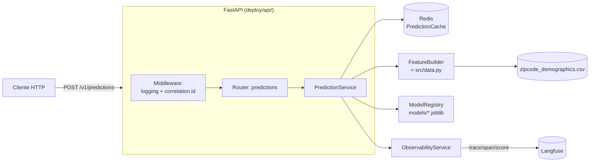

# Deploy — Implementação de Referência

Implementação real (não só o desenho) da [estratégia de deploy](../docs/deploy_strategy.md):
uma API FastAPI que serve o modelo de previsão de preços, com cache Redis,
observabilidade via Langfuse, containerizada e com manifests Kubernetes.

Todo o código é orientado a objetos, tipado (`from __future__ import
annotations` + type hints em toda função/atributo público) e documentado
com docstrings — ver `deploy/api/`.

## Arquitetura



- **`PredictionService`** orquestra tudo: checa o cache, constrói as
  features (reaproveitando `src/data.py` — o mesmo código do treino, para
  garantir zero *training-serving skew*), chama o modelo e registra uma
  trace no Langfuse.
- **`ModelRegistry`** carrega `models/model.joblib` +
  `models/quantile_{lower,upper}.joblib`, versiona pelo hash do artefato, e
  suporta hot-reload (`POST /v1/admin/reload-model`) sem reiniciar o
  processo.
- **`PredictionCache`** (Redis) cacheia por `(features, versão do modelo)` —
  trocar de modelo invalida implicitamente o cache antigo.
- **`ObservabilityService`** manda uma trace por requisição para o Langfuse
  (input, output, latência, cache hit rate) — no-op se desabilitado.

## Como rodar

### 1. Local (sem Docker)

```bash
# na raiz do repositório, com o venv do projeto já com as deps de deploy/requirements.txt
uv pip install -r deploy/requirements.txt
uv run uvicorn deploy.api.main:app --reload --port 8000
```

Abra http://localhost:8000/docs (Swagger UI — desabilitado automaticamente
se `APP_ENVIRONMENT=production`).

### 2. Docker Compose (API + Redis)

```bash
docker compose -f deploy/docker-compose.yml up --build
```

### 3. Docker Compose + Langfuse self-hosted (observabilidade completa local)

```bash
export LANGFUSE_ENCRYPTION_KEY=$(openssl rand -hex 32)
export LANGFUSE_SALT=$(openssl rand -base64 32)
export LANGFUSE_NEXTAUTH_SECRET=$(openssl rand -base64 32)
export LANGFUSE_POSTGRES_PASSWORD=$(openssl rand -base64 24)
export LANGFUSE_CLICKHOUSE_PASSWORD=$(openssl rand -base64 24)
export LANGFUSE_MINIO_PASSWORD=$(openssl rand -base64 24)
export LANGFUSE_REDIS_PASSWORD=$(openssl rand -base64 24)
export LANGFUSE_INIT_PROJECT_PUBLIC_KEY=pk-lf-$(openssl rand -hex 16)
export LANGFUSE_INIT_PROJECT_SECRET_KEY=sk-lf-$(openssl rand -hex 16)
export LANGFUSE_INIT_USER_PASSWORD=$(openssl rand -base64 16)
export APP_OBSERVABILITY_ENABLED=true
export APP_LANGFUSE_PUBLIC_KEY="$LANGFUSE_INIT_PROJECT_PUBLIC_KEY"
export APP_LANGFUSE_SECRET_KEY="$LANGFUSE_INIT_PROJECT_SECRET_KEY"
export APP_LANGFUSE_HOST="http://langfuse-web:3000"

docker compose -f deploy/docker-compose.yml -f deploy/docker-compose.langfuse.yml \
  --profile observability up --build
```

Org, projeto, usuário e o par de chaves acima são criados automaticamente no
primeiro startup (inicialização headless do Langfuse — nenhum passo manual
na UI necessário). UI disponível em http://localhost:3000
(`admin@house-price.local` / `$LANGFUSE_INIT_USER_PASSWORD`). Alternativa
mais simples: usar o [Langfuse Cloud](https://cloud.langfuse.com) em vez de
self-host — só definir as 3 variáveis `APP_LANGFUSE_*`, sem subir o stack
extra.

> **✅ Validado de ponta a ponta** (não é só um YAML não testado): subi o
> stack completo (Postgres + ClickHouse + MinIO + Redis + Langfuse web/worker,
> 4 migrations de Postgres + 46 de ClickHouse aplicadas com sucesso),
> confirmei a inicialização headless via `GET /api/public/projects`,
> mandei uma previsão real pela API e confirmei a trace `predict_batch`
> ingerida via `GET /api/public/v2/observations` — com `latency_ms` e
> `cache_hit_rate` batendo exatamente com a resposta HTTP da API
> (`GET /api/public/v3/scores`). Detalhes dos ajustes necessários (a
> lista de serviços "oficial" sozinha não sobe: faltava
> `CLICKHOUSE_MIGRATION_URL` — protocolo nativo porta 9000, diferente do
> endpoint HTTP porta 8123 — e o truque do MinIO para criar o bucket via
> `mkdir /data/langfuse` antes do `minio server`) já estão incorporados em
> `docker-compose.langfuse.yml`.

### 4. Kubernetes

```bash
# 1. build + push da imagem para um registry acessível pelo cluster
docker build -f deploy/Dockerfile -t <seu-registry>/house-price-api:latest .
docker push <seu-registry>/house-price-api:latest

# 2. edite deploy/k8s/kustomization.yaml (campo `images`) com a imagem acima
# 3. preencha deploy/k8s/secret.yaml (ou gere o Secret fora do repositório)
# 4. aplique
kubectl apply -k deploy/k8s/
```

Manifests inclusos: `Namespace`, `ConfigMap`, `Secret` (template),
`Deployment` + `Service` + `HorizontalPodAutoscaler` da API, `Deployment` +
`Service` + `PersistentVolumeClaim` do Redis, e um `Ingress` (NGINX +
cert-manager). Validado com `kubectl kustomize` (renderização), não contra
um cluster real.

## Testes

```bash
uv pip install -r deploy/requirements-dev.txt
uv run pytest deploy/tests/ -v
```

São testes de integração reais: sobem a aplicação completa (modelo
verdadeiro de `models/`), sem precisar de Redis/Langfuse rodando (cache e
observabilidade ficam desligados nos testes por padrão). Um dos testes
compara a previsão da API bit-a-bit com `outputs/future_predictions.csv`
para garantir que API e pipeline batch produzem exatamente o mesmo
resultado.

## Referência da API

| Método | Rota | Descrição |
|---|---|---|
| `POST` | `/v1/predictions` | Prevê preço (ponto + intervalo p10–p90) de 1..N imóveis |
| `GET` | `/v1/model` | Versão do modelo em produção, métricas de holdout, features esperadas |
| `GET` | `/health/live` | Liveness probe (sempre 200 se o processo está de pé) |
| `GET` | `/health/ready` | Readiness probe (checa modelo + Redis) |
| `POST` | `/v1/admin/reload-model` | Recarrega os artefatos do disco sem reiniciar (requer `X-Admin-Api-Key`) |
| `GET` | `/docs` | Swagger UI (desabilitado em produção) |

Exemplo de request para `/v1/predictions`:

```json
{
  "houses": [
    {
      "bedrooms": 4, "bathrooms": 1.0, "sqft_living": 1680, "sqft_lot": 5043,
      "floors": 1.5, "waterfront": 0, "view": 0, "condition": 4, "grade": 6,
      "sqft_above": 1680, "sqft_basement": 0, "yr_built": 1911, "yr_renovated": 0,
      "zipcode": 98118, "lat": 47.5354, "long": -122.273,
      "sqft_living15": 1560, "sqft_lot15": 5765
    }
  ]
}
```

## Variáveis de ambiente

Ver `deploy/api/config.py:Settings` (fonte da verdade) e `deploy/.env.example`.
Todas usam o prefixo `APP_`. Principais:

| Variável | Default | Descrição |
|---|---|---|
| `APP_ENVIRONMENT` | `development` | `production` desabilita `/docs`/`/redoc` |
| `APP_CACHE_ENABLED` | `true` | Liga/desliga o cache Redis |
| `APP_REDIS_URL` | `redis://localhost:6379/0` | Conexão do Redis |
| `APP_CACHE_TTL_SECONDS` | `3600` | TTL das previsões cacheadas |
| `APP_MAX_BATCH_SIZE` | `500` | Máximo de imóveis por requisição |
| `APP_OBSERVABILITY_ENABLED` | `false` | Liga/desliga o rastreamento Langfuse |
| `APP_LANGFUSE_PUBLIC_KEY` / `APP_LANGFUSE_SECRET_KEY` | — | Credenciais do projeto Langfuse |
| `APP_LANGFUSE_HOST` | `https://cloud.langfuse.com` | Cloud ou endereço do self-host |
| `APP_ADMIN_API_KEY` | — | Sem valor, `/v1/admin/reload-model` fica desabilitado (503) |

## O que é implementação de referência vs. o que trocaria em produção séria

Este é um projeto de portfólio/desafio técnico — a implementação é real e
testada, mas algumas escolhas são deliberadamente mais simples do que uma
stack de produção madura usaria. Documentado com honestidade, não escondido:

| Aqui | Em produção, trocaria por |
|---|---|
| `ModelRegistry` versiona por hash do arquivo local | MLflow Model Registry / SageMaker Model Registry (múltiplas versões, promoção/rollback via API, sem depender do filesystem do pod) |
| Redis single-replica (Deployment + PVC) | Redis gerenciado (ElastiCache/Memorystore) ou Operator com replicação |
| `X-Admin-Api-Key` estático para o endpoint de reload | OAuth2/mTLS/IAM do provedor de nuvem, endpoint só acessível de rede interna |
| Secret.yaml como template manual | External Secrets Operator / Sealed Secrets / cofre de segredos gerenciado |
| HPA por CPU | Métricas customizadas (latência p99, requisições/s) via Prometheus Adapter |
| `docker-compose.langfuse.yml` local | Langfuse Cloud, ou self-host operado por SRE dedicado |

Ver também [`docs/deploy_strategy.md`](../docs/deploy_strategy.md) para o
desenho completo (incluindo partes não implementadas aqui, como o pipeline
de treino automatizado) e [`docs/continuous_learning.md`](../docs/continuous_learning.md)
para a estratégia de retreino.
