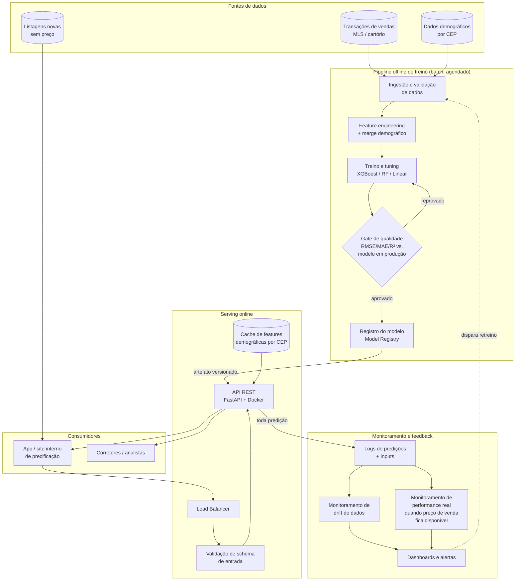

# Estratégia de Deploy

Este documento descreve como o modelo de previsão de preços poderia ser colocado
em produção. **Nada aqui foi implementado** — é o desenho de arquitetura, como
pedido no desafio.

## Visão geral

## Camadas

### 1. Ingestão e preparação de dados
- Job batch (Airflow/Dagster/Prefect) roda periodicamente (ex.: diário ou
  semanal) para atualizar a base de transações e os dados demográficos por CEP.
- Validação de schema e de qualidade de dados na entrada (ex.: `great_expectations`
  ou `pandera`) para pegar problemas como o outlier de `bedrooms=33` identificado
  na EDA **antes** dele entrar no treino.
- O merge com dados demográficos é feito nesta camada (`src/data.py` já
  implementa essa lógica de forma testável e reutilizável).

### 2. Treino e Model Registry
- Pipeline de treino reexecuta `src/train.py` (ou equivalente produtizado),
  gerando um novo candidato a modelo.
- Um **gate automático de qualidade** compara o candidato contra o modelo
  campeão atual em um conjunto de teste/validação fixo (holdout out-of-time,
  não aleatório, para simular o cenário real de prever vendas futuras).
  Só é promovido se igualar ou superar o campeão em RMSE/MAE dentro de uma
  margem de tolerância.
- Modelos aprovados são versionados em um **Model Registry** (MLflow, SageMaker
  Model Registry, ou até um bucket S3/GCS versionado com metadados em JSON),
  guardando: hash dos dados de treino, hiperparâmetros, métricas, data de
  treino e artefato serializado (`joblib`/`onnx`).

### 3. Serving (API)
- API REST leve (FastAPI) que expõe `POST /predict`, recebendo as mesmas
  colunas de `future_unseen_examples.csv` e retornando `predicted_price` (e
  idealmente um intervalo de confiança, ver seção de comunicação).
- Empacotada em container Docker, versão da imagem atrelada à versão do
  modelo carregado — a API carrega o artefato do Model Registry no startup
  (não faz treino online).
- Validação de entrada com Pydantic (tipos, ranges plausíveis, zipcode
  conhecido) rejeitando requisições malformadas antes de chegar ao modelo.
- Dados demográficos por CEP são poucos (70 linhas) e mudam raramente — podem
  ficar em cache em memória/Redis na API em vez de round-trip a um banco a
  cada requisição.
- Deploy em Kubernetes (ou serverless tipo AWS Lambda/SageMaker Endpoint) atrás
  de um load balancer, com autoscaling horizontal e health checks.

### 4. Monitoramento
- **Logging de todas as predições** (input + output + versão do modelo) para
  auditoria e para formar a base de dados de retreino futuro.
- **Monitoramento de drift de dados**: comparar a distribuição das features de
  entrada em produção com a distribuição vista no treino (ex.: `evidently`,
  KS-test por feature). Um CEP novo ou uma mudança no perfil de imóveis
  avaliados é um sinal de alerta.
- **Monitoramento de performance real**: como o preço de venda real de um
  imóvel só é conhecido semanas/meses depois da predição (ex.: quando a venda
  se concretiza), o pipeline deve religar `id`/endereço da predição com o
  preço de venda realizado assim que disponível, para recalcular
  RMSE/MAE em produção — não apenas confiar nas métricas de treino.
- Dashboards (Grafana/Looker) e alertas (Slack/PagerDuty) quando drift ou erro
  real ultrapassam limites definidos.

### 5. Versionamento
- **Código**: Git + tags de release.
- **Dados**: versionamento leve (ex.: DVC ou snapshot com data no nome do
  arquivo/partição) para poder reproduzir exatamente o dataset usado em cada
  modelo treinado.
- **Modelo**: cada modelo em produção tem um ID único (registry), permitindo
  rollback imediato para a versão anterior se o novo modelo apresentar
  problemas.
