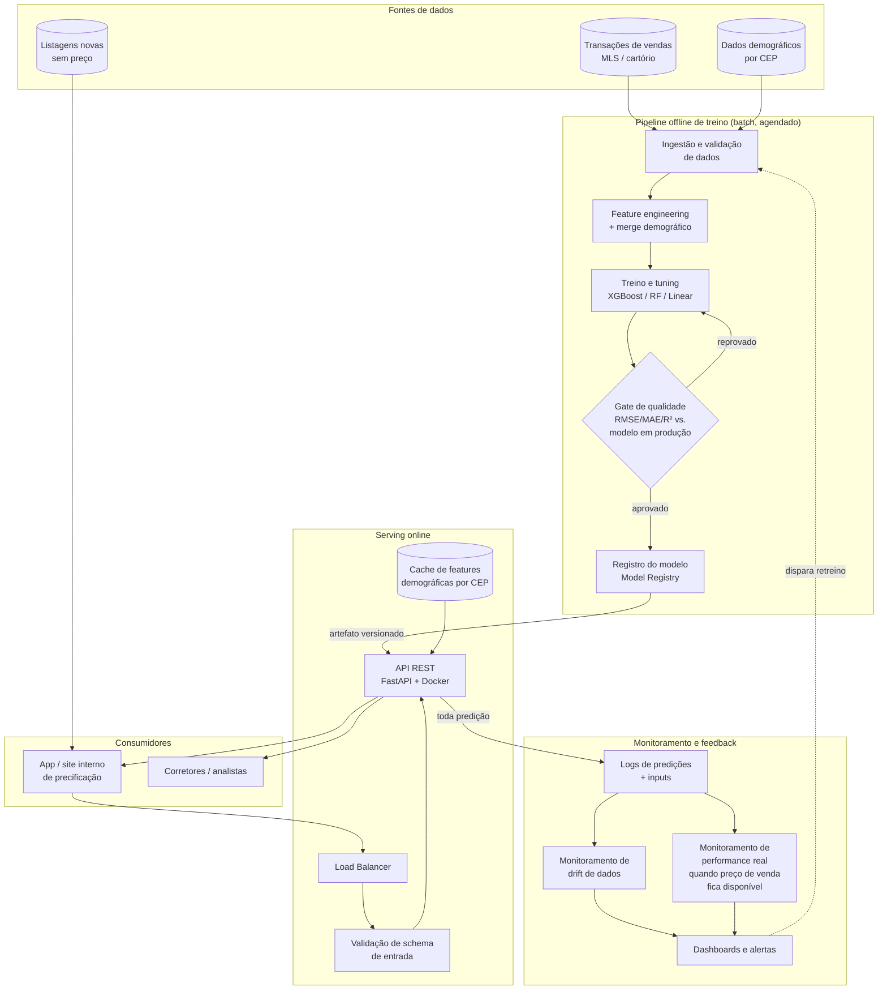

# Estratégia de Deploy

Este documento descreve como o modelo de previsão de preços poderia ser colocado
em produção.

> **Atualização**: além do desenho abaixo (que era o mínimo pedido no
> desafio), a camada de **serving (seção 3) e monitoramento (seção 4) foram
> efetivamente implementadas** neste repositório — API FastAPI completa,
> cache Redis, observabilidade via Langfuse, Docker/docker-compose e
> manifests Kubernetes. Ver [`deploy/README.md`](../deploy/README.md) para
> como rodar e [`deploy/api/`](../deploy/api/) para o código. As seções 1
> ("Ingestão"), 2 ("Treino e Model Registry" — exceto o registro em si, que
> é uma versão simplificada por hash, ver `deploy/api/services/model_registry.py`)
> e 5 ("Versionamento" de dados) continuam como desenho conceitual, não
> implementadas — o texto abaixo indica em cada seção o que é real e o que
> é proposta.

## Visão geral

## Camadas

### 1. Ingestão e preparação de dados
- Job batch (Airflow/Dagster/Prefect) roda periodicamente (ex.: diário ou
  semanal) para atualizar a base de transações e os dados demográficos por CEP.
- Validação de schema e de qualidade de dados na entrada (ex.: `great_expectations`
  ou `pandera`) para pegar problemas como o outlier de `bedrooms=33` identificado
  na EDA **antes** dele entrar no treino.
- O merge com dados demográficos é feito nesta camada (`src/data.py` já
  implementa essa lógica de forma testável e reutilizável).

### 2. Treino e Model Registry
- Pipeline de treino reexecuta `src/train.py` (ou equivalente produtizado),
  gerando um novo candidato a modelo.
- Um **gate automático de qualidade** compara o candidato contra o modelo
  campeão atual em um conjunto de teste/validação fixo (holdout out-of-time,
  não aleatório, para simular o cenário real de prever vendas futuras).
  Só é promovido se igualar ou superar o campeão em RMSE/MAE dentro de uma
  margem de tolerância.
- Modelos aprovados são versionados em um **Model Registry** (MLflow, SageMaker
  Model Registry, ou até um bucket S3/GCS versionado com metadados em JSON),
  guardando: hash dos dados de treino, hiperparâmetros, métricas, data de
  treino e artefato serializado (`joblib`/`onnx`).

### 3. Serving (API) — implementado em `deploy/`
- API REST em **FastAPI** (`deploy/api/`), fortemente tipada e orientada a
  objetos: `POST /v1/predictions` recebe as mesmas colunas de
  `future_unseen_examples.csv` em lote e retorna `predicted_price` **e** um
  intervalo de previsão (`predicted_price_low`/`predicted_price_high`,
  p10–p90), não só um ponto — ver seção de comunicação.
- Empacotada em container **Docker** (`deploy/Dockerfile`, multi-stage,
  imagem enxuta — dependências de treino/EDA como jupyter/matplotlib ficam
  de fora). Versão da imagem e versão do modelo são independentes: o
  `ModelRegistry` (`deploy/api/services/model_registry.py`) carrega o
  artefato no startup e versiona pelo hash do conteúdo — a API não treina
  nada em tempo de execução.
- Validação de entrada com **Pydantic** (tipos, ranges plausíveis, invariantes
  estruturais como `sqft_above + sqft_basement == sqft_living`, e checagem de
  CEP conhecido) rejeitando requisições malformadas antes de chegar ao
  modelo — inclusive rejeita automaticamente o mesmo padrão do outlier
  `bedrooms=33` removido no treino.
- Dados demográficos por CEP (70 linhas) ficam em memória no processo
  (`FeatureBuilder`); previsões completas (não só a feature demográfica)
  ficam em cache no **Redis**, chaveadas por `(features do imóvel, versão do
  modelo)` — trocar de modelo invalida o cache antigo automaticamente.
- Deploy em **Kubernetes** (`deploy/k8s/`): `Deployment` com liveness/readiness
  probes, `HorizontalPodAutoscaler`, `Service`, `Ingress`. Redis também
  roda no cluster (`Deployment` + `PersistentVolumeClaim`); um Redis
  gerenciado seria a troca natural em produção (ver `deploy/README.md`).

### 4. Monitoramento — implementado
- **Logging de todas as predições** (input + output + versão do modelo +
  latência + cache hit) via **Langfuse** — cada requisição vira uma trace
  (`ObservabilityService`, `deploy/api/services/observability.py`),
  auditável e reutilizável como base de dados de retreino futuro. Também há
  logging estruturado (JSON) de toda requisição HTTP, com correlation ID.
  Validado de ponta a ponta contra um Langfuse self-hosted real (não só
  integração de código): trace e scores (`latency_ms`, `cache_hit_rate`)
  conferidos via API do Langfuse batendo com a resposta HTTP da previsão —
  ver `deploy/README.md`.
- **Monitoramento de drift de dados** (desenho, não implementado): comparar a
  distribuição das features de entrada em produção com a distribuição vista
  no treino (ex.: `evidently`, KS-test por feature). Um CEP novo ou uma
  mudança no perfil de imóveis avaliados é um sinal de alerta. As traces do
  Langfuse já capturam os inputs necessários para isso — falta o job que
  analisa a distribuição agregada.
- **Monitoramento de performance real** (desenho, não implementado): como o
  preço de venda real de um imóvel só é conhecido semanas/meses depois da
  predição, o pipeline deveria religar `id`/endereço da predição com o
  preço de venda realizado assim que disponível, para recalcular RMSE/MAE
  em produção — não apenas confiar nas métricas de treino.
- Dashboards e alertas: o Langfuse já oferece visualização de latência/custo/
  volume de traces pronta; alertas de negócio (drift, erro real acima do
  limite) ainda dependem do job de monitoramento de performance acima.

### 5. Versionamento
- **Código**: Git + tags de release.
- **Dados**: versionamento leve (ex.: DVC ou snapshot com data no nome do
  arquivo/partição) para poder reproduzir exatamente o dataset usado em cada
  modelo treinado. Não implementado neste repositório.
- **Modelo**: implementado de forma simplificada — `ModelRegistry` gera um
  ID de versão a partir do hash sha256 do artefato (`model.joblib`), exposto
  em `GET /v1/model`. Rollback hoje é manual (trocar o arquivo e chamar
  `POST /v1/admin/reload-model`); em produção, isso seria a interface de um
  Model Registry de verdade (MLflow/SageMaker), com histórico de versões e
  promoção/rollback via API em vez de manipulação direta de arquivo — ver
  comparação completa em [`deploy/README.md`](../deploy/README.md).
